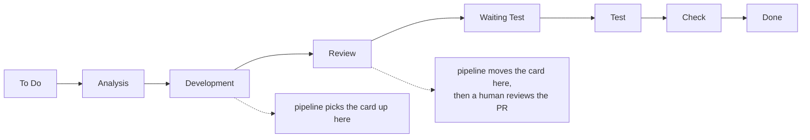

# Pipeline stages and current progress

Each stage is built, run against real data, and verified before the next begins
(ADR-0002). This file records where the build actually is — not where it is
intended to end up.

## Current state

**Step 1 — in progress on `feat/step-1-jira-fetch`.**

| Piece | State |
|---|---|
| `aidlc doctor` | Built and run against real Jira. Correctly reports the current blocker |
| `aidlc tools` | Built and run. 21 tools captured to `.aidlc/tools.json` |
| `aidlc fetch KEY` | **Not implemented.** Tool name is now known (`getJiraIssue`); blocked on authorization |
| Normalization + fixture test | Not started. Needs a real response to capture |

**Blocked on two things, both external to the code:**

1. **A scoped API token.** A classic token connects and lists tools but cannot call
   any of them. See ADR-0003 and `docs/SETUP.md` step 1.
2. ~~**An issue on the board.**~~ **Done:** `KAN-1`, "Add a --version flag to the
   aidlc CLI". It needs to be moved to `Development` to act as a trigger test.

## Target board

Project `KAN` ("aidlc-sandbox"), team-managed. Column order read from
`/rest/agile/1.0/board/1/configuration`:



Trigger status is **`Development`**; completion status is **`Review`** — the very
next column, so the pipeline's status move is an adjacent transition. Neither name
matches the "In development" / "In review" wording the pipeline was originally
specified against.

Note what the pipeline does *not* touch: everything from `Waiting Test` onward stays
human. The automation covers two columns.

Issue types: Epic, Story, Task, Feature, Bug, Subtask — so Stage 3 can create real
Jira subtasks.

> Use the board configuration endpoint for column order. `/project/{key}/statuses`
> returns an unordered set per issue type; an earlier revision of this file inferred
> an order from it and got it wrong. See ADR-0006.

`fetch` is deliberately absent rather than stubbed. The tool name is now known, but
its argument schema cannot be exercised and the response shape is unknown until a
call actually succeeds — and normalization is mostly a function of that shape.

**Next action is yours:** create a scoped API token, replace `JIRA_API_TOKEN` in
`.env`, and re-run `uv run aidlc doctor`.

## Stages


The two deterministic blocks bracketing the model block are the whole design idea
(ADR-0005): code watches and executes, the model thinks. Everything outside the
middle box is reproducible, free, fast and fails loudly; review attention belongs on
the middle box, which is the only place anything was decided by judgement.

| # | Stage | Decides / emits | Machinery | Status |
|---|---|---|---|---|
| 1 | **Fetch** | Issue key in, normalized issue JSON out | Code (ADR-0005) | Scoped, not built |
| 2 | **Detect** | Card entered trigger status, hands off issue key | Code, poller (ADR-0006) | Not started |
| 3 | **Break down** | Issue JSON in, ordered subtask plan out | Model | Not started |
| 4 | **Implement** | One subtask at a time, one commit each, on one branch | Model | Not started |
| 5 | **Publish** | Branch pushed, PR opened, card moved to review status | Code | Not started |

The split between code and model stages is deliberate and is the subject of
ADR-0005: code watches and executes, the model thinks.

Stage 4 writes commits unattended, so the commit convention (ADR-0007) is an output
contract of this pipeline rather than developer hygiene: one subtask, one
Conventional Commit, body explaining why. That history is the only record a reviewer
has of how the work was sequenced, and Stage 5 derives the PR description from it.
Commit quality therefore depends on breakdown quality in Stage 3.

## Step 1 — scope as agreed

**In scope:** authenticate to the Atlassian MCP server, fetch one issue by key,
normalize it, print it as JSON.

**Out of scope:** everything in stages 2–5. No git operations, no code generation,
no PR, no status transition, no trigger.

### Planned commands

| Command | Purpose |
|---|---|
| `uv run aidlc doctor` | Connect and confirm credentials work. The gate — nothing else matters until this passes. |
| `uv run aidlc tools` | Dump the server's `tools/list` to a scratch file. Discovery, not guesswork (ADR-0003). |
| `uv run aidlc fetch KEY` | Fetch one issue, emit normalized JSON. |

### Planned output shape

Provisional — the real field set depends on what the server returns, which is
unverified:

```json
{
  "key": "SCRUM-1",
  "summary": "...",
  "description": "...",
  "acceptance_criteria": "...",
  "status": "In development",
  "issue_type": "Story",
  "labels": [],
  "url": "https://acme.atlassian.net/browse/SCRUM-1"
}
```

### Known unknowns

Recorded because they are the likeliest source of surprise, per ADR-0003:

- ~~**Tool names.**~~ **Resolved.** 21 tools, read from `tools/list`. The ones this
  pipeline needs: `getJiraIssue` (Stage 1), `searchJiraIssuesUsingJql` (Stage 2),
  `transitionJiraIssue` (Stage 5). Every stage has a tool, which de-risks the rest
  of the build.
- **Description format.** Jira Cloud stores descriptions as Atlassian Document
  Format, a nested JSON structure, not plain text. Whether the MCP server flattens
  this to markdown or passes ADF through is unknown. If it is ADF, normalization
  needs a flattener, and that will be flagged rather than silently mangled.
- ~~**Acceptance criteria.**~~ **Resolved: there is no such field.** The instance has
  seven custom fields, all stock (`Flagged`, `Rank`, `Start date`, `Development`,
  `Team`, `Issue color`, `Agent Sessions`). So acceptance criteria live inside the
  description or nowhere, and `acceptance_criteria` cannot be a separate field in
  the normalized output. Stage 3 will have to work from the description text.
- **Legal transitions.** Mostly resolved on KAN-1: from `To Do`, every status is
  directly reachable, which is the team-managed "any to any" default. Still to
  confirm from a card in `Development`. Also found: transition names do not follow
  status renames (the transition into `Development` is still called `In Progress`),
  so Step 5 must choose a transition by destination status, not by name. See
  ADR-0006.
- **Description format, partly answered.** Jira stores KAN-1's description as ADF
  (Atlassian Document Format): headings as bold text, bullet lists, inline code all
  arrive as nested JSON nodes through REST v3. What the MCP `getJiraIssue` tool
  returns is a separate question. It may convert to markdown. Needs the scoped
  token to find out.
- ~~**Header handling.**~~ **Resolved.** Headers go via
  `create_mcp_http_client(headers=...)`; `streamable_http_client` has no `headers`
  argument. See ADR-0003.
- **Authorization.** A classic API token lists tools but cannot call them. Needs a
  scoped token. This is the current blocker.

### Done when

`uv run aidlc fetch <a real key>` prints correct JSON for a real card on the real
board, and a fixture captured from that response has an offline test covering
normalization.
