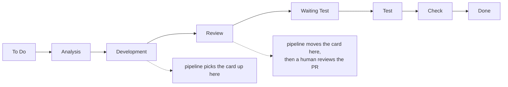
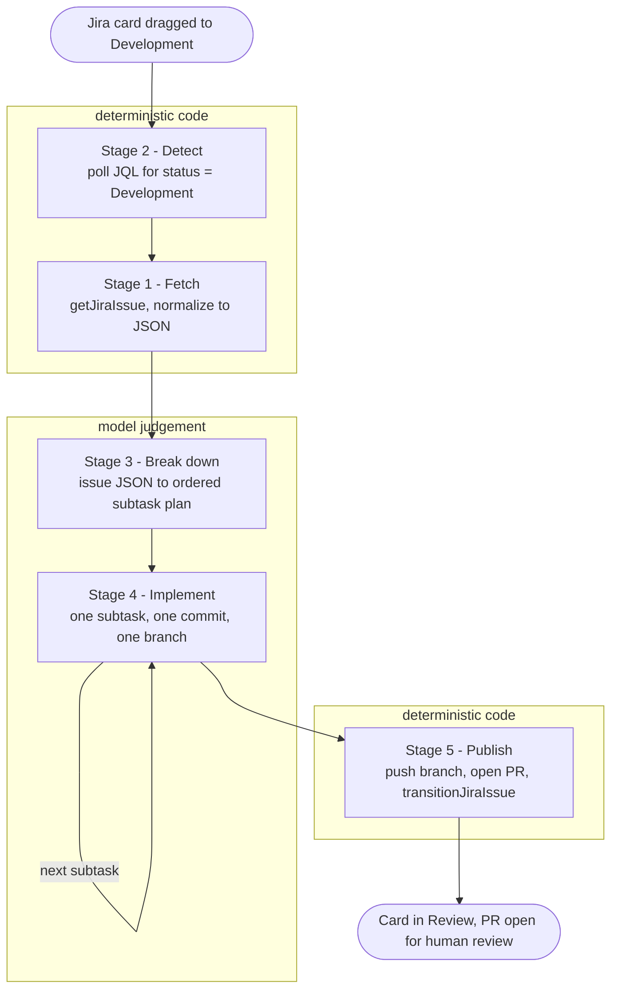
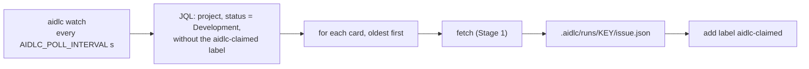

# Pipeline stages and current progress

Each stage is built, run against real data, and verified before the next begins
(ADR-0002). This file records where the build actually is — not where it is
intended to end up.

## Current state

**Step 2 — done, on `feat/step-2-detect`.** Verified against the live board on
2026-10-01. Not yet merged to `main`.

**Step 1 — done, merged to `main`** (PR #1).

| Piece | State |
|---|---|
| `aidlc doctor` | Passes against real Jira, including a Jira read. Diagnoses each setup failure met on the way |
| `aidlc fetch KEY` | Works. Prints the normalized issue; a missing key fails cleanly with exit 1 |
| `aidlc detect` | Works. Lists cards waiting to be picked up; read-only |
| `aidlc watch` | Works. Polls, claims each card with a label, writes its handoff file. Verified with a live loop |
| `aidlc tools` | Run. 21 tools captured to `.aidlc/tools.json` |

**Next: Step 3, Break down** — turn a handoff file into an ordered subtask plan.
The first stage where a model makes the decisions (ADR-0005).

## Target board

Project `KAN` ("aidlc-sandbox"), team-managed. Column order read from
`/rest/agile/1.0/board/1/configuration`:



Trigger status is **`Development`**; completion status is **`Review`** — the very
next column, so the pipeline's status move is an adjacent transition. Neither name
matches the "In development" / "In review" wording the pipeline was originally
specified against.

Note what the pipeline does *not* touch: everything from `Waiting Test` onward stays
human. The automation covers two columns.

Issue types: Epic, Story, Task, Feature, Bug, Subtask — so Stage 3 can create real
Jira subtasks.

> Use the board configuration endpoint for column order. `/project/{key}/statuses`
> returns an unordered set per issue type; an earlier revision of this file inferred
> an order from it and got it wrong. See ADR-0006.

`fetch` is deliberately absent rather than stubbed. The tool name is now known, but
its argument schema cannot be exercised and the response shape is unknown until a
call actually succeeds — and normalization is mostly a function of that shape.

**Next action is yours:** create a scoped API token, replace `JIRA_API_TOKEN` in
`.env`, and re-run `uv run aidlc doctor`.

## Stages



The two deterministic blocks bracketing the model block are the whole design idea
(ADR-0005): code watches and executes, the model thinks. Everything outside the
middle box is reproducible, free, fast and fails loudly; review attention belongs on
the middle box, which is the only place anything was decided by judgement.

| # | Stage | Decides / emits | Machinery | Status |
|---|---|---|---|---|
| 1 | **Fetch** | Issue key in, normalized issue JSON out | Code (ADR-0005) | **Done**, verified on KAN-1 |
| 2 | **Detect** | Card entered trigger status, hands off issue key | Code, poller (ADR-0006) | **Done**, verified on KAN-1 |
| 3 | **Break down** | Issue JSON in, ordered subtask plan out | Model | Not started |
| 4 | **Implement** | One subtask at a time, one commit each, on one branch | Model | Not started |
| 5 | **Publish** | Branch pushed, PR opened, card moved to review status | Code | Not started |

The split between code and model stages is deliberate and is the subject of
ADR-0005: code watches and executes, the model thinks.

Stage 4 writes commits unattended, so the commit convention (ADR-0007) is an output
contract of this pipeline rather than developer hygiene: one subtask, one
Conventional Commit, body explaining why. That history is the only record a reviewer
has of how the work was sequenced, and Stage 5 derives the PR description from it.
Commit quality therefore depends on breakdown quality in Stage 3.

## Step 1 — scope as agreed

**In scope:** authenticate to the Atlassian MCP server, fetch one issue by key,
normalize it, print it as JSON.

**Out of scope:** everything in stages 2–5. No git operations, no code generation,
no PR, no status transition, no trigger.

### Commands

| Command | Purpose |
|---|---|
| `uv run aidlc doctor` | Confirm credentials, scopes and a real Jira read. The gate — nothing else matters until this passes. |
| `uv run aidlc tools` | Dump the server's `tools/list` to `.aidlc/tools.json`. Discovery, not guesswork (ADR-0003). |
| `uv run aidlc fetch KEY` | Fetch one issue, print normalized JSON on stdout. |

### Output shape

Real output of `uv run aidlc fetch KAN-1`, description shortened:

```json
{
  "key": "KAN-1",
  "url": "https://your-site.atlassian.net/browse/KAN-1",
  "summary": "Add a --version flag to the aidlc CLI",
  "status": "Development",
  "issue_type": "Task",
  "priority": "Medium",
  "labels": [],
  "description": "**Context** ...

**Acceptance criteria**

* `uv run aidlc --version` prints ...",
  "description_format": "markdown",
  "subtasks": [],
  "updated": "2026-10-01T15:09:14.830-0300"
}
```

This shape is the contract every later stage reads; the raw MCP payload never
passes this boundary (`src/aidlc/jira/models.py`). Choices in it:

- **No `acceptance_criteria` field.** The instance has no such field, and pulling a
  section out by heading would silently drop criteria written any other way. They
  stay in `description`, and Stage 3 reads the whole text. This replaces the
  provisional shape planned before the server was reachable, which had one.
- **`description_format`** reports what the server actually sent: markdown is
  requested, HTML arrives for content markdown cannot hold.
- **`url`** is built from `JIRA_SITE_URL`; the response carries none.
- **`subtasks`** lists existing subtask keys, so Stage 3 can tell a fresh card from
  one it has already broken down.
- **No reporter or assignee.** Nothing downstream needs them, and they are personal
  data.

### Known unknowns

Recorded because they are the likeliest source of surprise, per ADR-0003:

- ~~**Tool names.**~~ **Resolved.** 21 tools, read from `tools/list`. The ones this
  pipeline needs: `getJiraIssue` (Stage 1), `searchJiraIssuesUsingJql` (Stage 2),
  `transitionJiraIssue` (Stage 5). Every stage has a tool, which de-risks the rest
  of the build.
- ~~**Description format.**~~ **Resolved: markdown.** Jira stores descriptions as
  ADF (Atlassian Document Format, nested JSON), but the MCP `getJiraIssue` tool
  converts to markdown and reports `appliedContentFormat`. No ADF handling needed.
- ~~**Acceptance criteria.**~~ **Resolved: there is no such field.** The instance has
  seven custom fields, all stock (`Flagged`, `Rank`, `Start date`, `Development`,
  `Team`, `Issue color`, `Agent Sessions`). So acceptance criteria live inside the
  description or nowhere, and `acceptance_criteria` cannot be a separate field in
  the normalized output. Stage 3 will have to work from the description text.
- **Legal transitions.** Mostly resolved on KAN-1: from `To Do`, every status is
  directly reachable, which is the team-managed "any to any" default. Still to
  confirm from a card in `Development`. Also found: transition names do not follow
  status renames (the transition into `Development` is still called `In Progress`),
  so Step 5 must choose a transition by destination status, not by name. See
  ADR-0006.
- ~~**Header handling.**~~ **Resolved.** Headers go via
  `create_mcp_http_client(headers=...)`; `streamable_http_client` has no `headers`
  argument. See ADR-0003.
- ~~**Authorization.**~~ **Resolved.** Needs an org-admin setting plus a token for
  the MCP server app with `*:jira:agent-interface` scopes. The four failures met on
  the way are in ADR-0003 and `docs/SETUP.md`.
- **Write access.** Partly exercised: Step 2 edits labels (`editJiraIssue`). Creating
  issues, comments and transitions are still untested; Steps 3 and 5 will be the first to
  comment and transition.

### Done when

`uv run aidlc fetch <a real key>` prints correct JSON for a real card on the real
board, and a fixture captured from that response has an offline test covering
normalization.

**Met on 2026-10-01** with KAN-1: `tests/test_models.py` runs against
`tests/fixtures/getJiraIssue.KAN-1.evidence.json`.

## Step 2 — Detect

**Scope as agreed:** notice cards waiting in the trigger status, claim them so they
are picked up once, and hand each one to Stage 1. No breakdown, no git, no status
change.

Decided at the start of the step: polling (ADR-0006), a claim label (ADR-0009).



### Commands

| Command | Purpose |
|---|---|
| `uv run aidlc detect` | List the cards a poll would pick up, as JSON. Writes nothing. |
| `uv run aidlc watch` | Poll until stopped (Ctrl-C), picking up each waiting card. |
| `uv run aidlc watch --once` | One poll, then exit. Exit 1 if any card failed. |

### Handoff to Stage 3

Each picked-up card's normalized JSON (the Step 1 shape) is written to
`.aidlc/runs/<KEY>/issue.json`. Stage 3 starts from that file. It is written under
a temporary name and renamed, so a reader never sees a half-written file. `.aidlc/`
is gitignored.

The file is a snapshot taken just before the claim, so its `labels` do not include
`aidlc-claimed`.

### Behaviour worth knowing

- **Re-running a card:** remove the `aidlc-claimed` label in Jira. The next poll
  picks it up again and overwrites its handoff file.
- **Failures are retried.** A card that cannot be fetched or saved is not claimed,
  so the next poll tries again. One failing card does not stop the others, and a
  failed poll does not end `watch`.
- **A card already in `Development` when the pipeline first runs is picked up.**
  Deliberate (ADR-0006). Start the pipeline on a board whose `Development` column
  holds only cards you want automated.

### Verified 2026-10-01

- `detect` found KAN-1.
- `watch --once` claimed KAN-1 (label read back from Jira) and wrote its handoff
  file; the next poll reported nothing waiting.
- With `watch --interval 10` running, removing the label from KAN-1 got it picked up
  again 15 seconds later, within one interval.
- 56 offline tests, including the pick-up order and each failure point.

### Done when

`aidlc watch` picks up a card that enters the trigger status, claims it so it is not
picked up twice, and leaves its normalized JSON where Stage 3 can read it, verified
on the real board. **Met** as above.
