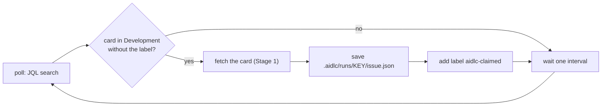

# ADR-0009 — Claim picked-up cards with a Jira label

- **Status:** Accepted
- **Date:** 2026-10-01
- **Decides:** How the pipeline remembers which cards it has already picked up.

## Context

The trigger is a poller (ADR-0006): every interval it searches for cards in
`Development`. A card stays in `Development` for the whole time the pipeline works
on it, and only moves to `Review` at the end (Stage 5). So without a marker, every
poll would pick the same card up again.

The marker has to answer "has the pipeline already taken this card?" in a way the
search itself can filter on, so that detection stays a single JQL query.

## Decision

When the pipeline picks a card up, it adds the label **`aidlc-claimed`**
(configurable as `AIDLC_CLAIM_LABEL`). Detection searches for:

```
project = KAN AND status = "Development"
  AND (labels IS EMPTY OR labels NOT IN ("aidlc-claimed"))
```

To make the pipeline pick a card up again, a person removes the label.



Details that matter:

- **The `labels IS EMPTY OR` clause is required.** Verified on the live board:
  `labels NOT IN ("aidlc-claimed")` on its own returns nothing for a card with no
  labels at all, because JQL does not treat "no labels" as "not this label". Without
  the clause, the pipeline would silently never pick up a fresh card, and nothing
  would error.
- **Claim last, not first.** The order is fetch, save, claim. If fetching or saving
  fails, the card is not claimed, so the next poll retries it. Claiming first would
  leave a failed card marked as taken, and it would sit there until someone noticed.
  The cost: if claiming itself fails after a successful save, the next poll repeats
  the fetch and overwrites the same file, which is harmless.
- **Read, merge, write.** `editJiraIssue` *replaces* the label list rather than
  adding to it. Sending only `["aidlc-claimed"]` would delete every label a person
  had put on the card. The pipeline reads the current labels, adds its own, and
  writes the full list back.

## Alternatives considered

### Local state file — rejected

A list of picked-up keys in `.aidlc/state.json`. No Jira writes at all, which is
attractive for a first version.

Rejected because the state is invisible and fragile. Nobody looking at the board can
tell the pipeline has taken a card; deleting the file, or running on a second
machine, makes the pipeline pick everything up again. And re-running a card means
editing a JSON file instead of removing a label in Jira.

### Comment on the card — rejected

A comment such as "Picked up by aidlc". Visible, and leaves a history.

Rejected because JQL cannot filter on comment text reliably, so "not yet claimed"
stops being one query. Detection would have to fetch every card in `Development`
and inspect its comments, which grows with the board.

### Move the card to a separate status on pickup — rejected

For example a new "In pipeline" column. The status would *be* the claim; no label
needed.

Rejected because it changes the board's workflow for the pipeline's convenience, and
because `Development` should keep meaning "being developed" whether a person or the
pipeline is doing it. A reasonable choice for a team that wants the pipeline's work
visible as its own column; a workflow decision rather than a pipeline one.

### Issue entity property — rejected

Jira supports hidden key-value metadata on issues, readable through `getJiraIssue`'s
`properties` argument. Invisible to people, so it cannot clutter the board.

Rejected because JQL cannot search entity properties without an app that declares
them indexed, so detection could not filter on it in a single query.

## Consequences

**Good**

- Detection stays one JQL query.
- Anyone can see on the board which cards the pipeline has taken.
- Re-running a card is a one-click action in Jira: remove the label.
- Works the same from any machine.

**Bad / accepted cost**

- **This is the pipeline's first write to Jira.** It exercises
  `write:jira:agent-interface`, which nothing before this has used.
- **Lost-update race.** If a person edits the card's labels between the pipeline's
  read and its write, the person's change is overwritten. The window is under a
  second; acceptable for a sandbox, not something to ignore at scale.
- A label is free text, and a person can add it by hand. A manually added
  `aidlc-claimed` makes the pipeline skip that card.

**Unverified at time of writing**

- That `editJiraIssue` accepts a label change with this token. Step 2's first run is
  the test.

## Open questions

- **When is the label removed?** If a reviewer sends a card back from `Review` to
  `Development`, the label is still on it, so the pipeline will not pick it up again.
  Whether Stage 5 should remove the label when it moves the card, or whether a
  bounced card should wait for a person, is a Stage 5 decision.

## Portability to a company setting

The mechanism ports; the label may not. Teams often have label conventions, and a
shared Jira may have many projects where an `aidlc-claimed` label means nothing to
anyone. Making the label name configurable covers the simple case.

A company running several pipelines, or one pipeline across many projects, should
also look again at the dedicated-status alternative: it is more visible on the board
and immune to someone typing the label by hand.
